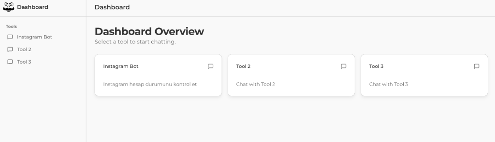
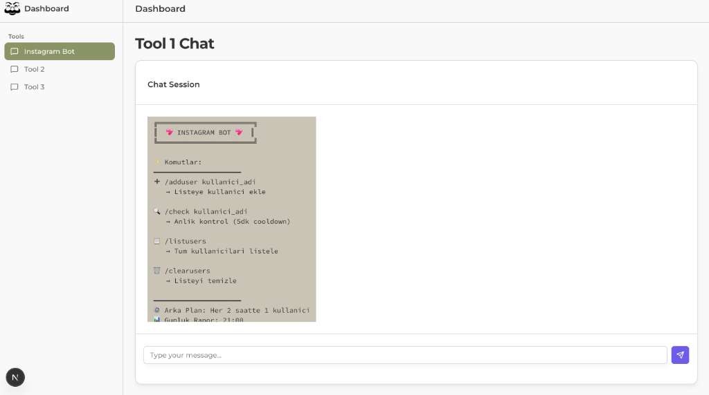
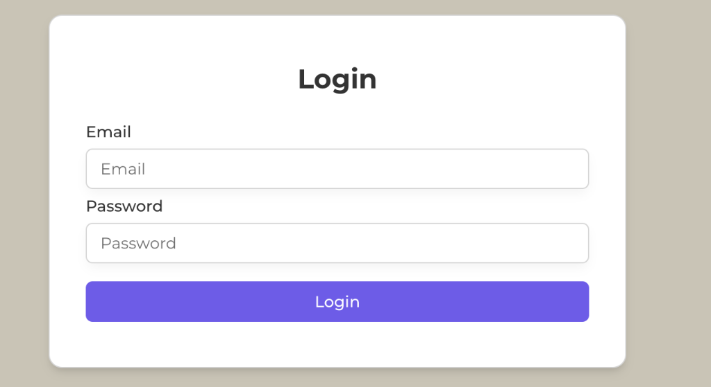

# Dashboard Bot

Advanced dashboard application featuring an integrated Instagram Bot tool, built with Next.js, TypeScript, and Supabase.
Designed by **@codedbyelif** 

---

## English

### About the Project
This project is a comprehensive dashboard application that allows you to manage various bot tools through a modern web interface. With the integrated **Instagram Bot** tool (developed by **@codedbyelif**), you can monitor Instagram user statuses, verify account activity, and maintain accurate database records.

### Key Features

#### Dashboard & Interface

- **Modern UI:** A stylish, intuitive interface designed with Tailwind CSS and shadcn/ui.
- **Dark & Light Mode Support:** High contrast and easily distinguishable design.
- **Responsive Design:** Fully compatible with both mobile and desktop views, ensuring seamless usability anywhere.
- **Secure Login:** Global password-protected login screen to prevent unauthorized access.

- **Sidebar Navigation:** Easy-to-use menu for quickly switching between different dashboard sections.

#### Instagram Bot Tool

- **User Tracking:** Add users to the monitoring list effortlessly with the `/adduser [username]` command.
- **Status Checks:** Run on-demand status checks via the `/check` command.
- **Automated Background Service:** Periodically verifies user statuses automatically using background services (checking every defined interval).
- **Detailed Reporting:** Visual reporting indicating whether accounts are Active, Rate Limited, Banned, or Not Found.
- **Interactive Chat Interface:** Terminal/Telegram-like chat interface for running bot commands smoothly.
- **Database Logging:** All user data, including status changes and logs, are securely and persistently stored on Supabase.
- **Telegram Notifications:** Get real-time updates directly to your Telegram chat whenever an account status changes.

### Folder Structure

```text
.
├── public/                 # Static assets (logos, icons)
├── src/
│   ├── app/
│   │   ├── api/            # Backend API routes
│   │   │   ├── chat/       # Chat command processing and bot operations
│   │   │   └── login/      # Authentication API
│   │   ├── dashboard/      # Dashboard interface pages
│   │   │   ├── chat/       # Terminal-like chat interface
│   │   │   └── page.tsx    # Dashboard overview page
│   │   ├── layout.tsx      # Global application layout
│   │   └── page.tsx        # Login page entry point
│   ├── components/         # Reusable React components
│   │   ├── dashboard/      # Specific components like Sidebar, Header, UserList
│   │   └── ui/             # Core UI components (Buttons, Inputs, Cards, etc.)
│   └── lib/                # Core logic and utility libraries
│       ├── instagram.ts    # Instagram scraping and status check logic
│       ├── instagram-manager.ts # Bot command router and response handler
│       ├── supabase.ts     # Supabase database connection and helper functions
│       └── tool-runner.ts  # Background tool execution service
├── create_users_table.sql  # Database initialization SQL script
└── package.json            # Project dependencies and deployment scripts
```

### Installation and Local Configuration

#### Prerequisites
- Node.js (v18 or higher recommended)
- A Supabase account and project
- A Telegram Bot Token (optional but recommended for notifications)
- Git installed on your system

#### Step-by-Step Guide

1. **Clone the Repository:**
   Open your terminal and run the following commands to download the project and navigate into the directory:
   ```bash
   git clone https://github.com/codedbyelif/dashboard-bot.git
   cd dashboard-bot
   ```

2. **Install Dependencies:**
   Install all required Node.js packages by running:
   ```bash
   npm install
   ```

3. **Configure Environment Variables:**
   Create a new file named `.env.local` in the root directory. Copy the structure from the example file and fill it with your credentials:
   ```env
   # Supabase Database Connection
   SUPABASE_URL=https://your-project.supabase.co
   SUPABASE_SERVICE_ROLE_KEY=your-supabase-service-role-key

   # Authentication & Security
   JWT_SECRET=your-secure-jwt-secret
   COOKIE_NAME=app_token
   GLOBAL_PASSWORD=your-secure-dashboard-password
   NODE_ENV=development

   # Telegram Bot Configuration
   TELEGRAM_BOT_TOKEN="your:telegram-bot-token"
   CHAT_ID="your-telegram-chat-id"

   # Instagram Bot Settings
   CHECK_TIME=30 # Check interval in minutes
   
   # Proxy Settings (Optional)
   PROXY_HOST=proxy.example.com
   PROXY_PORT=8080
   PROXY_USER=username
   PROXY_PASS=password
   ```

4. **Initialize the Database:**
   - Log in to your Supabase dashboard.
   - Go to the SQL Editor section.
   - Copy the contents of the `create_users_table.sql` file from your project folder.
   - Paste and execute it to create the necessary `users` and `messages` tables.

5. **Start the Application:**
   Once everything is configured, start the local development server:
   ```bash
   npm run dev
   ```
   Open your browser and navigate to `http://localhost:3000` to access the application.

### Available Commands
Use these commands within the dashboard's chat interface:
- `/help` - Displays the list of available commands.
- `/adduser [username]` - Adds a new user to the checking list.
- `/deluser [username]` - Removes a user from the list.
- `/listusers` - Displays all tracked users and their current statuses.
- `/check` - Manually forces an immediate status check of all users on the list.
- `/clear` - Clears the chat screen history.

### Deployment (e.g., Vercel)
1. Push your code to your GitHub repository.
2. Link your GitHub repository to your Vercel account.
3. Import the project.
4. Add all environment variables from `.env.local` into the Vercel **Environment Variables** section.
   - **Important Troubleshooting:** If you encounter a "Server configuration error" when trying to log in after deployment, this means you forgot to add `GLOBAL_PASSWORD` and `JWT_SECRET` to your Vercel Environment Variables. Go to your Vercel Project Settings > Environment Variables, add them exactly as they are in your `.env.local` file, and Redeploy your project.
5. Click **Deploy**. Your application will be live shortly.

---

## Turkce (Turkish)

### Proje Hakkinda
Bu proje, modern bir web arayuzu uzerinden cesitli bot araclarini yonetmenizi saglayan kapsamli bir dashboard (kontrol paneli) uygulamasidir. Icerisinde bulunan **Instagram Bot** araci (**@codedbyelif** tarafindan gelistirilmis) sayesinde Instagram hesap durumlarini izleyebilir, periyodik kontroller yapabilir ve veri tabanina kalici olarak isleyebilirsiniz.

### Temel Ozellikler

#### Dashboard & Arayuz

- **Modern UI:** Tailwind CSS ve shadcn/ui ile tasarlanmis sik, anlasilir ve kullanici dostu bir arayuz.
- **Dark & Light Mode (Karanlik ve Aydinlik Mod):** Kolay okunabilirlik saglayan arayuz temalari.
- **Responsive (Duyarli) Tasarim:** Hem mobil telefonlarda hem de bilgisayar ekranlarinda kusursuz gorunum.
- **Guvenli Giris:** Tek bir master sifre (Global Password) ile korunan guvenli yetkilendirme sistemi.

- **Kenar Cubugu:** Sayfalar ve uygulamalar arasinda hizli gecis yapmanizi saglayan modern menu sistemi.

#### Instagram Bot Araci

- **Kullanici Takibi:** Kullanicilari `/adduser [kullanici_adi]` komutu ile kolayca takip listesine dahil etme.
- **Durum Analizi:** `/check` komutu ile tum listeyi istediginiz zaman elle tarama.
- **Otomatik Arka Plan Servisi:** Tanimlanan araliklarla arka planda kendiliginden calisan durum kontrol mekanizmasi.
- **Detayli Raporlama:** Hesaplarin Aktif, Kisitlanmis (Rate Limit), Yasakli (Banned) veya Bulunamadi (Not Found) seklindeki anlik durumlari.
- **Etkilesimli Sohbet Ekrani:** Telegram/Terminal tarzi komut giris ekrani ile botu kod yazar gibi yonetebilme imkani.
- **Veritabani Entegrasyonu:** Gerceklesen tum durum degisiklikleri ve mesajlasmalarin anlik olarak Supabase'e kaydedilmesi.
- **Telegram Bildirimleri:** Hesaplarin durumlarindaki bir degisikligi aninda Telegram bildirimleriyle cebinize iletebilme.

### Dosya ve Klasor Yapisi

```text
.
├── public/                 # Statik dosyalar (logo, ikon gibi)
├── src/
│   ├── app/
│   │   ├── api/            # Arka plan (Backend) API isteklerinin karsilandigi yer
│   │   │   ├── chat/       # Sohbet komutlarinin islenmesi
│   │   │   └── login/      # Giris yapma islemleri
│   │   ├── dashboard/      # Kullanici paneli sayfalari
│   │   │   ├── chat/       # Terminal benzeri bot chat ekrani
│   │   │   └── page.tsx    # Sitenin ana gosterge paneli
│   │   ├── layout.tsx      # Tum site icin ana duzenleyici cerceve
│   │   └── page.tsx        # Ilk karsilama ve giris sayfasi
│   ├── components/         # Tekrar kullanilabilir React parcalari
│   │   ├── dashboard/      # Menu, alt menu, liste gibi panele ozel yapilar
│   │   └── ui/             # Buton, yazi kutusu vb. ana tasarim bilesenleri
│   └── lib/                # Projenin beyni (Fonksiyonlar ve Veritabani dosyalari)
│       ├── instagram.ts    # Instagram durum sorgulama mantigi
│       ├── instagram-manager.ts # Komutlarin analiz edilip yanitlandigi dosya
│       ├── supabase.ts     # Supabase veritabani baglantisi
│       └── tool-runner.ts  # Arka planda otomasyon calistiran bot servisi
├── create_users_table.sql  # Veritabani tablolari icin hazir kurulum kodlari
└── package.json            # Proje uygulamalari ve yuklu paket listesi
```

### Kurulum ve Lokal Ayarlar

#### Gerekli Araclar
- Node.js (Surum 18 ve uzeri onerilir)
- Bir Supabase hesabi ve aktif bir proje
- Bir Telegram Bot Token'i (Bildirimler isterseniz)
- Bilgisayarinizda mukabil Git kurulumu

#### Adim Adim Kurulum Rehberi

1. **Projeyi Bilgisayariniza Indirin:**
   Terminali baslatin ve su komutlarla projeyi bilgisayariniza cekip klasore giris yapin:
   ```bash
   git clone https://github.com/codedbyelif/dashboard-bot.git
   cd dashboard-bot
   ```

2. **Gerekli Paketleri Yukleyin:**
   Indiginiz bu proje dosyasinda bagimliliklari topluca kurun:
   ```bash
   npm install
   ```

3. **Cevre (Environment) Degiskenlerini Ayarlayin:**
   Ana klasor dizininde `.env.local` isminde yeni bir dosya yaratin ve asagidaki kaliba gore kendi bilgilerinizi girin:
   ```env
   # Supabase Veritabani Bilgileri
   SUPABASE_URL=https://sizin-projeniz.supabase.co
   SUPABASE_SERVICE_ROLE_KEY=sizin-hizmet-rolu-anahtariniz

   # Guvenlik İslemleri
   JWT_SECRET=ozel-guvenli-jwt-sifreniz
   COOKIE_NAME=app_token
   GLOBAL_PASSWORD=sisteme-giris-sifreniz
   NODE_ENV=development

   # Telegram Botu Ayarlari
   TELEGRAM_BOT_TOKEN="sizin:telegram-bot-uygulamasi-tokeniniz"
   CHAT_ID="sizin-telegram-sohbet-kimligi-id-numaraniz"

   # Instagram Bot Genel Ayari
   CHECK_TIME=30 # Kontrollerin kac dakikada bir yapilacagi
   
   # Proxy (Vekil Sunucu) Ayarlari (Istege Bagli)
   PROXY_HOST=proxy.ornek.com
   PROXY_PORT=8080
   PROXY_USER=kullaniciadi
   PROXY_PASS=sifre
   ```

4. **Veritabanini Baslatin:**
   - Supabase sitenize gidip projenizin ana panelinden 'SQL Editor' sayfasina girin.
   - Projedeki `create_users_table.sql` tablosunun tum textlerini kopyalayin.
   - SQL Editor uzerinde yapistirip calistirin. Bu sayede gerekli olan `users` ve `messages` kayitlari acilacaktir.

5. **Siteyi Calistirin:**
   Her sey tamam, projeyi ayaklandirmak icin su komutu girin:
   ```bash
   npm run dev
   ```
   Web tarayiciniza `http://localhost:3000` yazarak programi goruntuleyebilirsiniz.

### Kullanilabilir Komutlar
Dashboard uzerindeki chat kisminda bu formulleri kullanabilirsiniz:
- `/help` - Tum komut lisesini gosterir.
- `/adduser [username]` - Sisteme takip edilecek yepyeni birini ekler.
- `/deluser [username]` - Ismini yazdiginiz kisiyi sistemden cikarir.
- `/listusers` - Sistemdeki mevcut herkesin son durumunu listeler.
- `/check` - Arka plani beklemeden o anda anlik guncelleme taramasi baslatir.
- `/clear` - Ekrandaki gereksiz ve eski mesaj bulutlarini temizler.

### Projeyi Yayina Alma (Ornegin Vercel)
1. Yerelde yaptiginiz degisiklikleri kendi GitHub hesabiniza `push` ile gonderin.
2. Vercel uzerinden GitHub'daki bu reponuzu birbirine baglayin.
3. Reponun projesini secerek Import kismina ilerleyin.
4. **Environment Variables** (Cevre Degiskenleri) isimli bolume tipki `.env.local` sayfanizdaki gibi SUPABASE_URL vb. ifadeleri degerleri ile beraber teker teker verin.
   - **Onemli Hata Cozumu:** Yayina aldiktan sonra giris yaparken "Server configuration error" hatasi aliyorsaniz, Vercel uzerine `GLOBAL_PASSWORD` ve `JWT_SECRET` degiskenlerini eklemeyi unutmussunuz demektir. Vercel Proje Ayarlarindan (Settings) Cevre Degiskenleri (Environment Variables) sekmesine gidin, bu eksik bilgileri `.env.local` dosyanizdaki haliyle ekleyin ve projeyi yeniden yayinlayin (Redeploy).
5. **Deploy** dugmesine tiklayin ve yuklemenin bitmesini bekleyin, projeniz kisa surede yayinda olacaktir.

---

### Tech Stack / Kullanilan Teknolojiler
- **Framework:** [Next.js](https://nextjs.org/)
- **Dil:** [TypeScript](https://www.typescriptlang.org/)
- **Veritabani:** [Supabase](https://supabase.com/)
- **Tasarim:** [Tailwind CSS](https://tailwindcss.com/)
- **Arayuz Bilesenleri:** [shadcn/ui](https://ui.shadcn.com/)
- **Gorseller:** [Lucide React](https://lucide.dev/)

---

Developed by **@codedbyelif**
